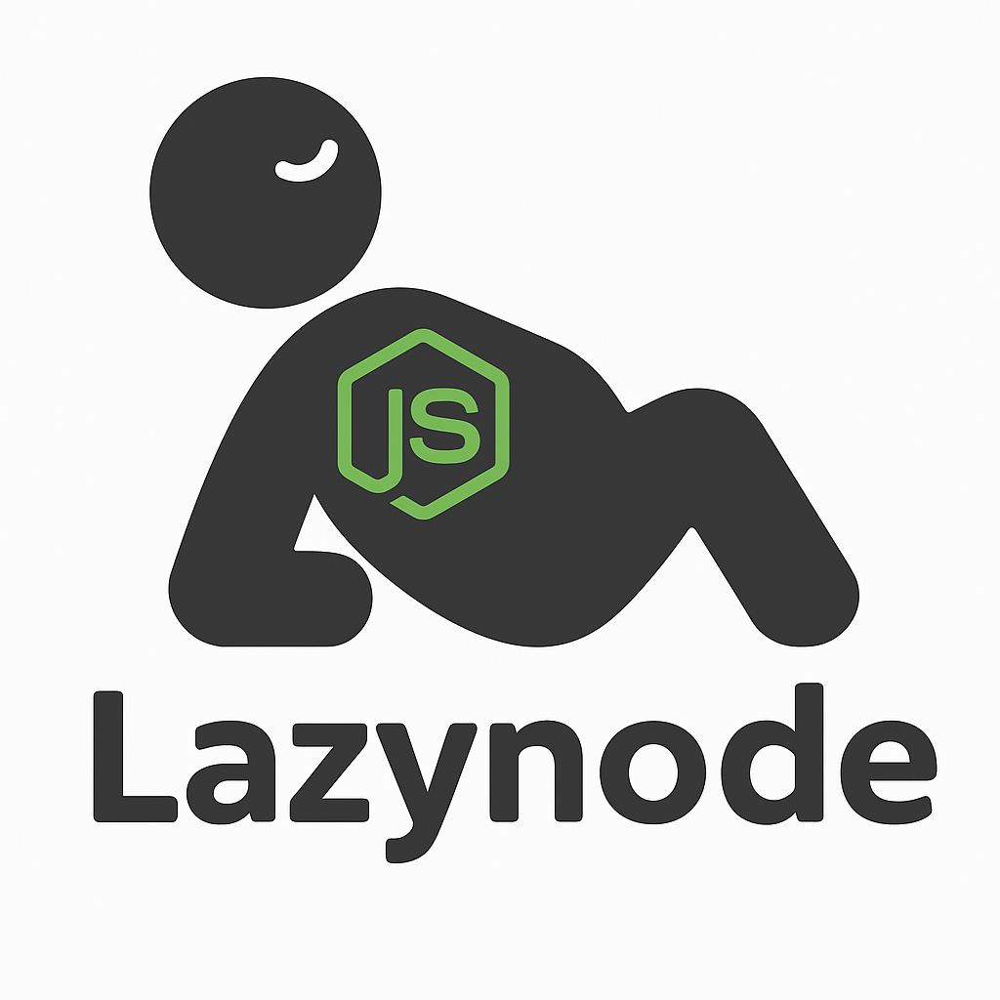

# LazyNode

<p align="center">
  
</p>

<p align="center">
  <pre align="center">
  ██╗      █████╗ ███████╗██╗   ██╗███╗   ██╗ ██████╗ ██████╗ ███████╗
  ██║     ██╔══██╗╚══███╔╝╚██╗ ██╔╝████╗  ██║██╔═══██╗██╔══██╗██╔════╝
  ██║     ███████║  ███╔╝  ╚████╔╝ ██╔██╗ ██║██║   ██║██║  ██║█████╗  
  ██║     ██╔══██║ ███╔╝    ╚██╔╝  ██║╚██╗██║██║   ██║██║  ██║██╔══╝  
  ███████╗██║  ██║███████╗   ██║   ██║ ╚████║╚██████╔╝██████╔╝███████╗
  ╚══════╝╚═╝  ╚═╝╚══════╝   ╚═╝   ╚═╝  ╚═══╝ ╚═════╝ ╚═════╝ ╚══════╝
  </pre>
  <br>
  <em>A powerful Terminal UI for managing Node.js projects with style</em>
</p>

<p align="center">
  <a href="#features">Features</a> •
  <a href="#ui-enhancements">UI Enhancements</a> •
  <a href="#installation">Installation</a> •
  <a href="#usage">Usage</a> •
  <a href="#keyboard-shortcuts">Shortcuts</a> •
  <a href="#panels-overview">Panels</a> •
  <a href="#development">Development</a> •
  <a href="#contributing">Contributing</a> •
  <a href="#license">License</a>
</p>

---

LazyNode is a feature-rich terminal user interface inspired by Lazygit that helps you manage Node.js projects without having to remember or type npm/npx commands. Boost your productivity with an intuitive, keyboard-driven interface for all your Node.js development needs.


## Features

### 📦 Package Management
- Install regular and dev dependencies with a few keystrokes
- Uninstall packages with confirmation dialog
- Check for outdated packages and update them
- View detailed package information
- Manage all dependencies through a visually appealing interface

### 🧪 Script Management
- List and run npm scripts interactively
- Monitor script execution in real-time
- View script logs with automatic timestamps

### ⚡ NPX Integration
- Execute npx commands directly from the UI
- Access frequently used commands quickly
- Get suggestions for popular npx tools

### 🖥️ Modern Terminal UI
- Side-by-side panel layout for efficient navigation
- Real-time animations and progress indicators
- Fully keyboard navigable with intuitive shortcuts
- Smart navigation between panels (Alt+Up/Down) and within content (Up/Down)
- Context-sensitive command display

## UI Enhancements

LazyNode features several UI enhancements to provide a rich terminal experience:

### 🎨 Vibrant Color Scheme
- A carefully crafted terminal color palette with distinct colors for different UI elements
- Bright accent colors for important actions and status indicators
- Gradients and color transitions for an elegant look-and-feel

### 🔠 ASCII Art & Text Styling
- Beautiful ASCII art logo on splash and quit screens
- Stylized borders, shadows, and panels
- Rich text formatting with bold, underline, and italic styles

### ⚡ Animations & Visual Effects
- Dynamic loading animations during operations
- Smooth fade-in/fade-out transitions between screens
- Matrix-style particle effects on the splash screen
- Interactive progress bars and spinners

### 🎭 Terminal Enhancements
- Terminal-style command prompt in the logs panel
- Colorized output based on message type (error, warning, success)
- Styled ASCII borders for terminal-authentic feel
- Animated input prompts and confirmation dialogs

## Installation

### Using Go (from source)

```bash
# Install directly using Go
go install github.com/VesperAkshay/lazynode/cmd/lazynode@latest

# Or clone and build manually
git clone https://github.com/VesperAkshay/lazynode.git
cd lazynode
go build -o lazynode cmd/lazynode/main.go

# Move the binary to your PATH (optional)
sudo mv lazynode /usr/local/bin/
```

### Pre-built Binaries

Download the pre-built binary for your platform from the [Releases](https://github.com/VesperAkshay/lazynode/releases) page.

#### Quick Install Scripts

**Linux/macOS:**
```bash
curl -sSL https://raw.githubusercontent.com/VesperAkshay/lazynode/main/scripts/install.sh | bash
```

**Windows PowerShell (Run as Administrator):**
```powershell
iwr -useb https://raw.githubusercontent.com/VesperAkshay/lazynode/main/scripts/install.ps1 | iex
```

#### Manual Install

**Linux/macOS:**
```bash
# Download the latest release (example for Linux amd64)
curl -L https://github.com/VesperAkshay/lazynode/releases/latest/download/lazynode_linux_amd64 -o lazynode

# Make it executable
chmod +x lazynode

# Move to a directory in your PATH
sudo mv lazynode /usr/local/bin/
```

**Windows:**
Download the appropriate `.exe` file from the Releases page and add it to your PATH.

### Package Managers

#### Homebrew (macOS and Linux)
```bash
brew tap lazynode/lazynode
brew install lazynode
```

#### Scoop (Windows)
```powershell
scoop bucket add lazynode https://github.com/lazynode/scoop-bucket.git
scoop install lazynode
```

## Usage

Navigate to your Node.js project directory and run:

```bash
lazynode
```

This will launch the LazyNode interface, automatically detecting your project's package.json file.

## Keyboard Shortcuts

LazyNode uses intuitive keyboard shortcuts for efficient navigation and control:

### Global Navigation
| Key | Action |
|-----|--------|
| `↑` / `k` | Move up in current panel |
| `↓` / `j` | Move down in current panel |
| `←` / `h` | Move left (when applicable) |
| `→` / `l` | Move right (when applicable) |
| `Alt+↑` / `Alt+k` | Go to previous panel |
| `Alt+↓` / `Alt+j` | Go to next panel |
| `Tab` | Cycle through panels |
| `1` | Switch to Scripts panel |
| `2` | Switch to Packages panel |
| `3` | Switch to Project panel |
| `4` | Switch to NPX panel |
| `5` | Switch to Logs panel |
| `?` | Toggle help screen |
| `q` | Quit with elegant exit animation |

### Package Management (Packages Panel)
| Key | Action |
|-----|--------|
| `a` | Show all package actions |
| `i` | Install a package |
| `Shift+i` | Install as dev dependency |
| `d` | Uninstall selected package |
| `o` | Check for outdated packages |
| `u` | Update selected package |
| `/` | Search packages |
| `Enter` | Select/activate package |
| `Esc` | Cancel current action |

### Script Management (Scripts Panel)
| Key | Action |
|-----|--------|
| `Enter` | Run selected script |
| `r` | Reload scripts list |

### NPX Commands (NPX Panel)
| Key | Action |
|-----|--------|
| `n` | Create new NPX command |
| `Enter` | Run selected NPX command |
| `Esc` | Cancel current action |

### General Actions
| Key | Action |
|-----|--------|
| `r` | Reload/refresh current view |
| `e` | Edit package.json |

## Panels Overview

LazyNode's interface is divided into multiple panels, each with a specific purpose:

### 📜 Scripts Panel
Displays all available npm scripts from your package.json file. Select and run scripts with a single keystroke.

### 📦 Packages Panel
Shows all dependencies (regular and development) installed in your project. Install, update, and remove packages with ease.

### 🔍 Project Panel
Provides an overview of your project, including package.json details, Node.js version, and environment information.

### ⚡ NPX Panel
Execute NPX commands without leaving the terminal UI. Includes history and suggestions for popular commands.

### 🖥️ Terminal Panel
Displays real-time output from running scripts, package operations, and system messages with color-coded formatting.

## Special Screens

### 🚀 Splash Screen
An animated ASCII art welcome screen that appears when LazyNode starts up.
- Features a dynamic progress bar with stage indicators
- Matrix-style falling characters animation
- Smooth transition to the main interface

### 👋 Quit Screen
A farewell animation when you exit LazyNode.
- Fade-in/fade-out effect with thank you message
- Randomized farewell messages
- Gradient color effects

## Development

LazyNode is built with Go and uses the following libraries:

- [Bubble Tea](https://github.com/charmbracelet/bubbletea): Terminal UI framework
- [Lip Gloss](https://github.com/charmbracelet/lipgloss): Style definitions
- [Bubbles](https://github.com/charmbracelet/bubbles): UI components

To set up the development environment:

```bash
# Install dependencies
go mod download

# Run the application
go run cmd/lazynode/main.go

# Build for your platform
make build

# Build for all platforms
make cross-build
```

## Customization

LazyNode supports customization of its appearance and behavior:

### Color Themes
Colors are defined in the `pkg/ui/panels.go` file. Modify the terminal color variables to create your own theme.

### ASCII Art
The ASCII art for splash and quit screens can be found in `pkg/ui/splash.go` and `pkg/ui/quit.go`. Feel free to customize them to your liking.

### Key Bindings
Key bindings are defined in `pkg/ui/model.go`. You can modify them to match your preferences.

## Contributing

Contributions are welcome! Please feel free to submit a Pull Request.

1. Fork the repository
2. Create your feature branch (`git checkout -b feature/amazing-feature`)
3. Commit your changes (`git commit -m 'Add some amazing feature'`)
4. Push to the branch (`git push origin feature/amazing-feature`)
5. Open a Pull Request

## License

This project is licensed under the MIT License - see the [LICENSE](LICENSE) file for details.

## Acknowledgments

- Inspired by [Lazygit](https://github.com/jesseduffield/lazygit)
- Built with [Bubble Tea](https://github.com/charmbracelet/bubbletea)
- Thanks to all contributors and the Node.js community! 